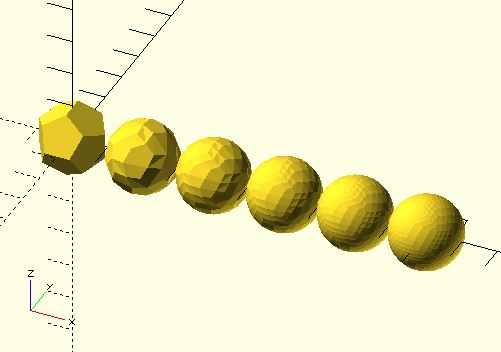

# dodecahedron

Creates a dodecahedron.

**Since:** 3.2

## Parameters

- `radius` : Radius of the dodecahedron.
- `detail` : Default to 0. Setting this to a value greater than 0 adds vertices making it no longer a dodecahedron.

## Examples

	use <polyhedra/dodecahedron.scad>

	for(i = [0:5]) {
		translate([i * 2, 0])
			dodecahedron(radius = 1, detail = i);
	}

