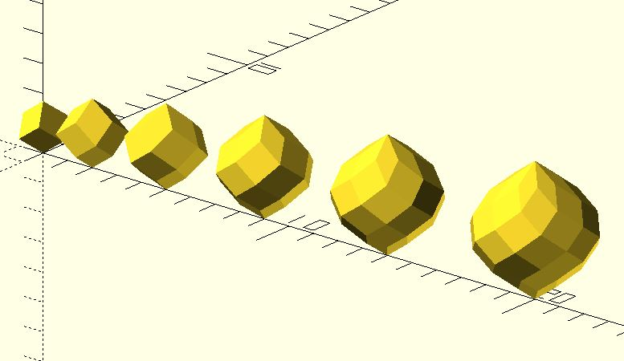

# polar_zonohedra

Creates a [polar zonohedra](https://mathworld.wolfram.com/PolarZonohedron.html).

**Since:** 3.2

## Parameters

- `n` : n equal rhombs surrounding one vertex. (rotational symmetry)
- `theta` : the pitch angle of the edges. Default to 35.5.

## Examples

	use <polyhedra/polar_zonohedra.scad>

	for(n = [3:8]) {
		translate([0.5 * n * (n - 3), 0, 0])
			polar_zonohedra(n);
	}

