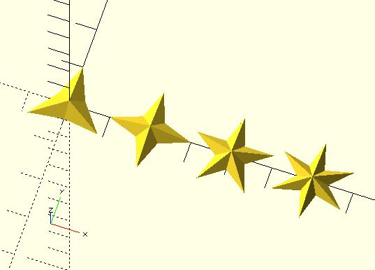

# star

Create a star. Default to a pentagram.

**Since:** 3.2

## Parameters

- `outer_radius`: The outer radius of the star. Default to 1.
- `inner_radius`: The inner radius of the star. Default to 0.381966.
- `height`: The star height. Default to 0.5.
- `n`: The burst number. Default to 5.

## Examples

	use <polyhedra/star.scad>

	for(i = [3:6]) {
		translate([(i - 3) * 2, 0])
			star(n = i);
	}

