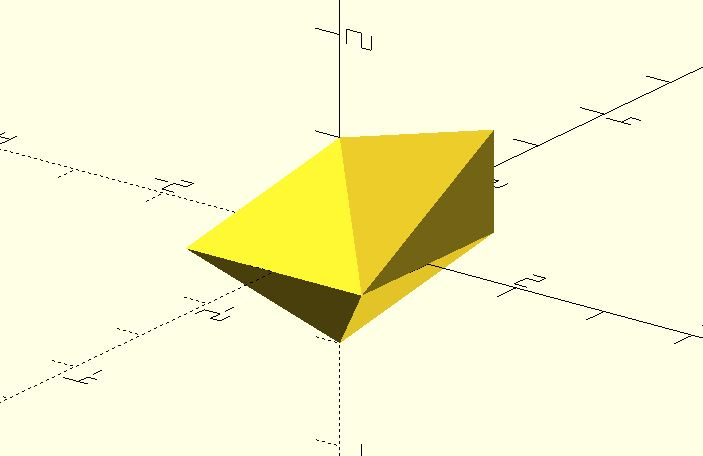

# polyhedron_hull

Create a convex polyhedron by hulling a list of points. It avoids using `hull` and small 3D primitives to create the polyhedron.

**Since:** 2.5

## Parameters

- `points` : A list of 3D points.

## Examples

	use <polyhedron_hull.scad>

	polyhedron_hull([
		[1, 1, 1],
		[1, 1, 0],
		[-1, 1, 0],
		[-1, -1, 0],
		[1, -1, 0],
		[0, 0, 1],
		[0, 0, -1]
	]);

