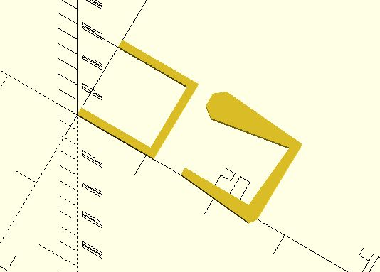
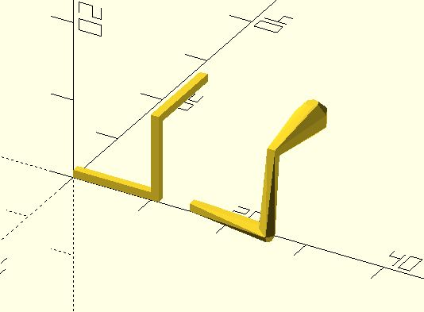

# polyline_join

Place a join on each point. Hull each pair of joins and union all convex hulls.

**Since:** 3.2

## Parameters

- `points` : a list of points.

## Examples
  
    use <polyline_join.scad>
    
    polyline_join([[0, 0], [10, 0], [10, 10], [0, 10]]) 
        square(1);
        
    polyline_join([[15, 0], [25, 0], [25, 10], [15, 10]]) {
        square(1);
        circle(1);
        square(1);
        circle(2);
    }

    use <polyline_join.scad>
        
    polyline_join([[0, 0, 0], [10, 0, 0], [10, 0, 10], [10, 10, 10]]) 
        cube(1);
        
    polyline_join([[15, 0, 0], [25, 0, 0], [25, 0, 10], [25, 10, 10]]) {
        cube(1);
        sphere(1);
        cube(1);
        sphere(2);
    }

