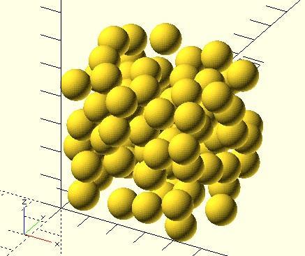

# pp_poisson3

Perform poisson sampling over a cube space. An 3D implementation of [Fast Poisson Disk Sampling in Arbitrary Dimensions](https://www.cs.ubc.ca/~rbridson/docs/bridson-siggraph07-poissondisk.pdf).

**Since:** 3.3

## Parameters

- `size` : The size `[x, y]` of the rectangle.
- `r` : The minimum distance between samples.
- `start` : Optional. The initial point(s).
- `k` : Default to 30. The `k` constant of [Fast Poisson Disk Sampling in Arbitrary Dimensions](https://www.cs.ubc.ca/~rbridson/docs/bridson-siggraph07-poissondisk.pdf).
- `seed` : Optional. Seed value for random number generator for repeatable results. 

## Examples

    use <pp/pp_poisson3.scad>

    points = pp_poisson3([50, 50, 50], 10);
    for(p = points) {
        translate(p)
            sphere(5, $fn = 48);
    }

