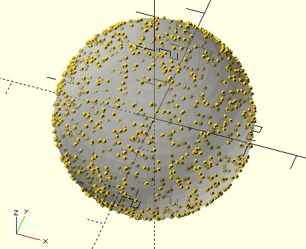

# pp_sphere

Pick random points on the surface of a sphere.

**Since:** 3.3

## Parameters

- `radius` : The radius of the sphere.
- `value_count` : Number of random numbers to return as a vector.
- `seed` : Optional. Seed value for random number generator for repeatable results. 

## Examples

    use <pp/pp_sphere.scad>

    number = 1000;
    radius = 2;

    points = pp_sphere(radius, number);

    for(p = points) {
        translate(p)
            sphere(.05);
    }

    %sphere(radius, $fn = 48);

