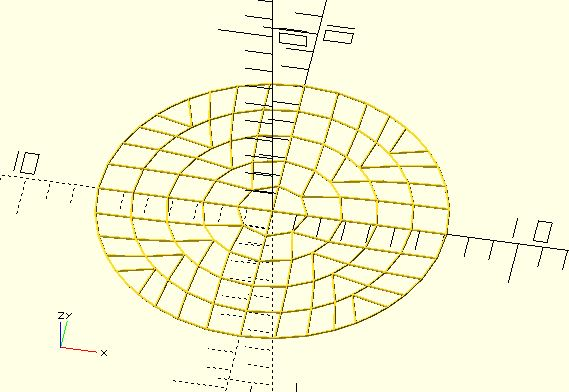

# ptf_circle

Transform a point inside a rectangle to a point inside a circle. You can use it to create something such as a [noisy circle maze](https://github.com/JustinSDK/dotSCAD/blob/master/examples/maze/noisy_circle_maze.scad).

**Since:** 2.3

## Parameters

- `size` : 2 value array `[x, y]`, rectangle with dimensions `x` and `y`.
- `point` : The point to be transformed.

## Examples

    use <polyline_join.scad>;
    use <ptf/ptf_circle.scad>;

    size = [10, 10];

    rows = [
        for(y = [0:size[1]])
            [for(x = [0:size[0]]) [x, y]]
    ];

    columns = [
        for(x = [0:size[0]])
            [for(y = [0:size[1]]) [x, y]]
    ];

    for(line = rows) {
        transformed = [for(p = line) ptf_circle(size, p)];
        polyline_join(transformed)
		    sphere(.05);
    }

    for(line = columns) {
        transformed = [for(p = line) ptf_circle(size, p)];
        polyline_join(transformed)
		    sphere(.05);
    }

