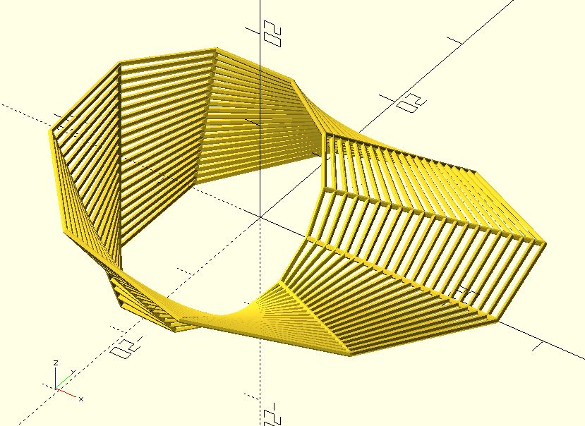

# ptf_ring

Transforms a point inside a rectangle to a point of a ring. It can create things such as [tiled_line_mobius](https://github.com/JustinSDK/dotSCAD/blob/master/examples/tiled_line_mobius.scad).

**Since:** 2.3

## Parameters

- `size` : 2 value array `[x, y]`, rectangle with dimensions `x` and `y`.
- `point` : The point to be transformed.
- `radius` : The radius of the ring.
- `angle` : The central angle of the arc.
- `twist` : The number of degrees of through which the rectangle is twisted.

## Examples

    use <polyline_join.scad>
    use <ptf/ptf_ring.scad>

    size = [20, 10];
    radius = 5;

    rows = [
        for(y = [0:size.y])
            [for(x = [0:size.x]) [x, y]]
    ];

    columns = [
        for(x = [0:size.x])
            [for(y = [0:size.y]) [x, y]]
    ];

    for(line = rows) {
        transformed = [for(p = line) ptf_ring(size, p, radius, 360, 180)];
		polyline_join(transformed)
		    sphere(.25);
    }

    for(line = columns) {
        transformed = [for(p = line) ptf_ring(size, p, radius, 360, 180)];
		polyline_join(transformed)
		    sphere(.25);
    }

