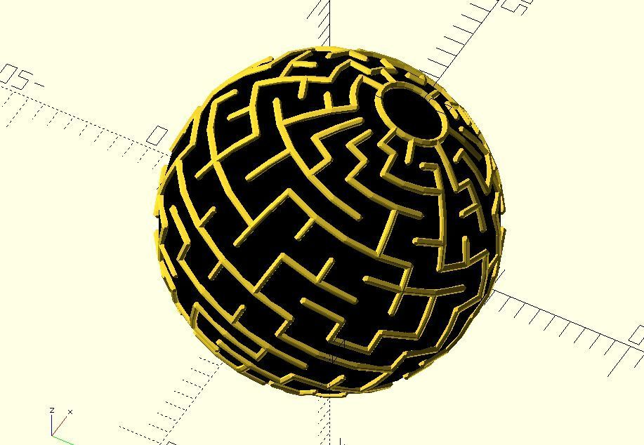
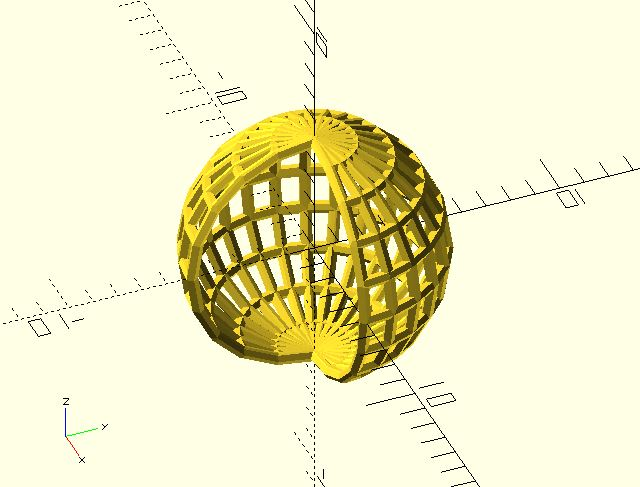

# ptf_sphere

Transforms a point inside a rectangle to a point of a sphere. It can create things such as [sphere maze](https://github.com/JustinSDK/dotSCAD/blob/master/examples/maze/sphere_maze.scad).

**Since:** 2.3

## Parameters

- `size` : 2 value array `[x, y]`, rectangle with dimensions `x` and `y`.
- `point` : The point to be transformed.
- `radius` : The radius of the sphere.
- `angle` : [za, xa] mapping angles.

## Examples

    use <polyline_join.scad>
    use <ptf/ptf_sphere.scad>

    size = [20, 10];
    radius = 5;
    angle = [180, 270];

    rows = [
        for(y = [0:size.y])
            [for(x = [0:size.x]) [x, y]]
    ];

    columns = [
        for(x = [0:size.x])
            [for(y = [0:size.y]) [x, y]]
    ];

    for(line = rows) {
        transformed = [for(p = line) ptf_sphere(size, p, radius, angle)];
        polyline_join(transformed)
            sphere(.25);
    }

    for(line = columns) {
        transformed = [for(p = line) ptf_sphere(size, p, radius, angle)];
        polyline_join(transformed)
            sphere(.25);
    }

