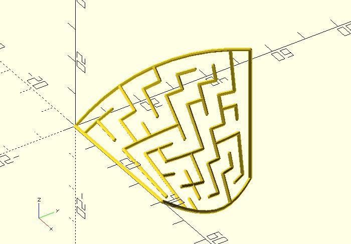
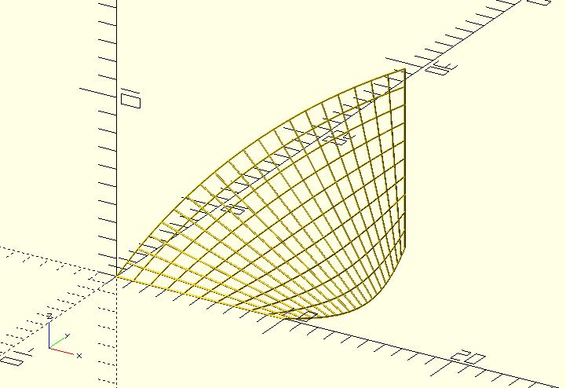

# ptf_y_twist

Twist a point along the y-axis. You can use it to create something such as a [twisted maze](https://github.com/JustinSDK/dotSCAD/blob/master/examples/maze/twisted_maze.scad).

**Since:** 2.3

## Parameters

- `size` : 2 value array `[x, y]`, rectangle with dimensions `x` and `y`.
- `point` : The point to be twisted.
- `angle` : The number of degrees.

## Examples

    use <polyline_join.scad>
    use <ptf/ptf_y_twist.scad>

    size = [10, 20];

    rows = [
        for(y = [0:size.y])
            [for(x = [0:size.x]) [x, y]]
    ];

    columns = [
        for(x = [0:size.x])
            [for(y = [0:size.y]) [x, y]]
    ];

    for(line = rows) {
        twisted = [for(p = line) ptf_y_twist(size, p, 90)];
        polyline_join(twisted)
		    sphere(.05);
    }

    for(line = columns) {
        twisted = [for(p = line) ptf_y_twist(size, p, 90)];
        polyline_join(twisted)
		    sphere(.05);
    }

