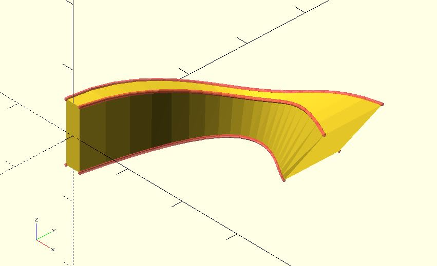

# rails2sections

Create sections along rails. Combined with the `sweep` module, you can describe a more complex model.

Rails should be indexed count-clockwisely.

**Since:** 3.2

## Parameters

- `rails` : A list of rails used to describe the surface of the model.

## Examples

	use <rails2sections.scad>
	use <polyline_join.scad>
	use <sweep.scad>
	
	rails = [
	    [[5, 0, 5], [15, 10, 10], [25, 20, 5]],
	    [[-5, 0, 5], [-15, 10, 10], [-25, 20, 5]],
	    [[-5, 0, -5], [-15, 10, -10], [-25, 20, -5]],  
	    [[5, 0, -5], [15, 10, -10], [25, 20, -5]]
	];
	
	sections = rails2sections(rails);
	
	sweep(sections);
	
	#for(path = rails) {
	    polyline_join(path)
		    sphere(.25);
	}

	use <bezier_curve.scad>
	use <rails2sections.scad>
	use <polyline_join.scad>
	use <sweep.scad>
	
	t_step = 0.05;
	
	rails = [
	    bezier_curve(t_step, 
	        [[1.25, 0, 5], [5, 20, 5], [16, 20, -2], [18, 20, 10], [30, 15, 8]]
	    ),
	    bezier_curve(t_step, 
	        [[-1.25, 0, 5], [0, 20, 5],  [16, 22, -2], [18, 20, 10], [30, 25, 8]]
	    ),
	    bezier_curve(t_step, 
	        [[-1.25, 0, -5], [0, 20, -5], [16, 20, 1], [18, 27, -3], [20, 27, -5]]
	    ),
	    bezier_curve(t_step, 
	        [[1.25, 0, -5], [5, 20, -5], [16, 20, 1], [18, 17.5, -3], [20, 17.5, -5]]
	    )
	];
	
	
	sections = rails2sections(rails);
	
	sweep(sections);
	
	#for(path = rails) {
	    polyline_join(path)
		    sphere(.25);
	}

