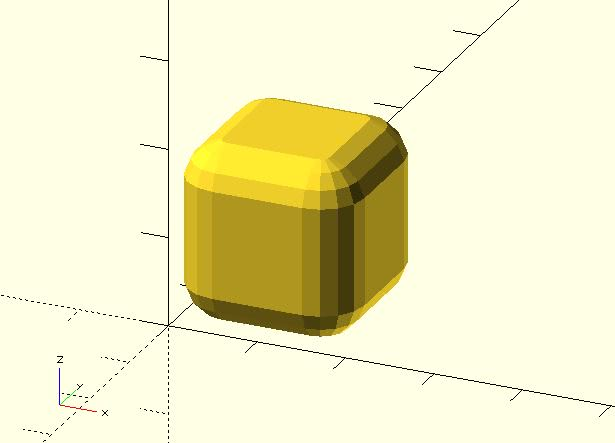

# rounded_cube

Creates a cube in the first octant. 

## Parameters

- `size` : Accepts a single value, cube with all sides this length. It also accepts 3 value array `[x, y, z]`, cube with dimensions `x`, `y` and `z`.
- `corner_r` : The corner is one-eight of a sphere. The `corner_r` parameter determines the sphere radius.
- `center` : `false` (default), 1st (positive) octant, one corner at (0,0,0). `true`, cube is centered at (0,0).
- `$fa`, `$fs`, `$fn` : Used to control the eight quadrants. Check [the circle module](https://en.wikibooks.org/wiki/OpenSCAD_User_Manual/Using_the_2D_Subsystem#circle) for more details. The final fragments of a sphere will be a multiple of 4 to fit edges.

## Examples

	use <rounded_cube.scad>
	
	rounded_cube(20, 5);

	use <rounded_cube.scad>
	
	rounded_cube(
	    size = [50, 25, 15], 
	    corner_r = 5,
	    center = true
	);

	use <rounded_cube.scad>
	
	$fn = 8;
	
	rounded_cube(
	    size = [50, 25, 15], 
	    corner_r = 5,
	    center = true
	);

