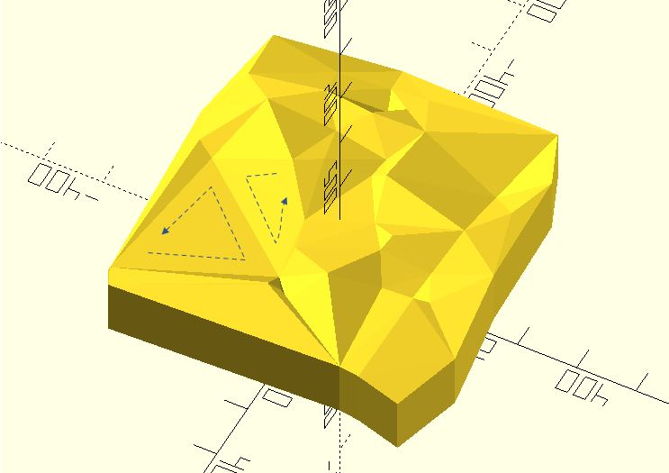
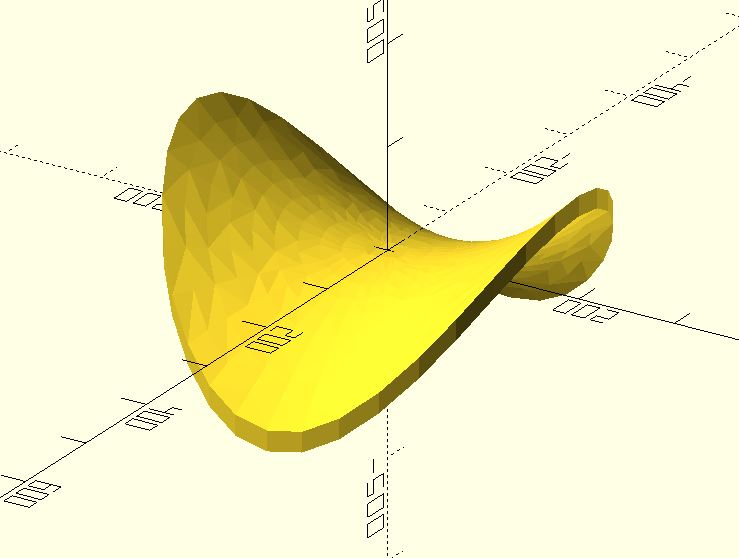

# sf_solidifyT

It solidifies two surfaces with triangular mesh. 

**Since:** 3.1

## Parameters

- `points1` : A list of `[x, y, z]`s.
- `points2` : A list of `[x, y, z]`s.
- `triangles` : Determine which points are connected by an edge. All triangles have points in the same direction, counter-clockwise. See examples below.
- `convexity` : Integer. This parameter is needed only for correct display of the object in OpenCSG preview mode. It has no effect on the polyhedron rendering. For display problems, setting it to 10 should work fine for most cases. **Since:** 3.3

## Examples

    use <triangle/tri_delaunay.scad>
    use <surface/sf_solidifyT.scad>

    points = [for(i = [0:50]) rands(-300, 300, 2)]; 
    triangles = tri_delaunay(points);

    pts = [for(p = points) [p.x, p.y, rands(100, 150, 1)[0]]];
    pts2 = [for(p = pts) [p.x, p.y, p.z - 100]];

    sf_solidifyT(pts, pts2, triangles = triangles);	

    use <triangle/tri_delaunay.scad>
    use <surface/sf_solidifyT.scad>

    thickness = .2;
    a_step = 15;
    r_step = 0.2;
    scale = 100;

    function f(x, y) = (y ^ 2 - x ^ 2) / 4;

    pts2d = [
        for(a = [a_step:a_step:360], r = [r_step:r_step:2])
        let(
            x = r * cos(a), 
            y = r * sin(a)
        )
        [x, y] 
    ];

    points1 = [for(p = pts2d) scale * [p.x, p.y, f(p.x, p.y)]];
    points2 = [for(p = points1) [p.x, p.y, p.z - scale * thickness]];
    triangles = tri_delaunay(pts2d);

    sf_solidifyT(points1, points2, triangles);

