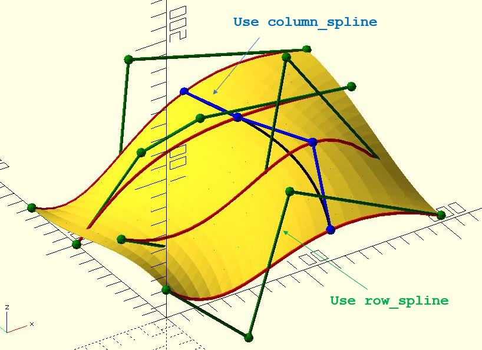
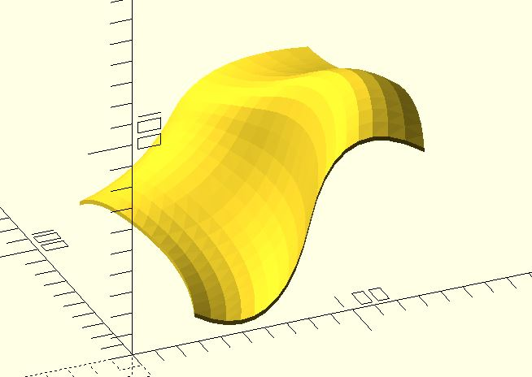

# sf_splines

Given a set of control points and spline functions, the `sf_splines` function returns surface points.

**Since:** 3.1

## Parameters

- `ctrl_pts` : A set of control points. See examples below.
- `row_spline` : The spline function for row points.
- `column_spline` : The spline function for columns points. Default to `row_spline`.

## Examples

If you want to make a bezier surface:

	use <bezier_curve.scad>
	use <surface/sf_splines.scad>
	use <surface/sf_thicken.scad>

	ctrl_pts = [
		[[0, 0, 20],  [60, 0, -35],   [90, 0, 60],    [200, 0, 5]],
		[[0, 50, 30], [100, 60, -25], [120, 50, 120], [200, 50, 5]],
		[[0, 100, 0], [60, 120, 35],  [90, 100, 60],  [200, 100, 45]],
		[[0, 150, 0], [60, 150, -35], [90, 180, 60],  [200, 150, 45]]
	];

	thickness = 2;
	t_step = 0.05;

	bezier = function(points) bezier_curve(t_step, points);

	sf_thicken(sf_splines(ctrl_pts, bezier), thickness);

The following figure shows controll points and bazier curves around the surface.

If you want to make a bspline surface:

	use <bspline_curve.scad>
	use <surface/sf_thicken.scad>
	use <surface/sf_splines.scad>

	ctrl_pts = [
		[[0, 0, 20],  [60, 0, -35],   [90, 0, 60],    [200, 0, 5]],
		[[0, 50, 30], [100, 60, -25], [120, 50, 120], [200, 50, 5]],
		[[0, 100, 0], [60, 120, 35],  [90, 100, 60],  [200, 100, 45]],
		[[0, 150, 0], [60, 150, -35], [90, 180, 60],  [200, 150, 45]]
	];

	thickness = 2;
	t_step = 0.05;
	degrees = 2;

	bspline = function(points) bspline_curve(t_step, degrees, points);

	sf_thicken(sf_splines(ctrl_pts, bspline), thickness);

