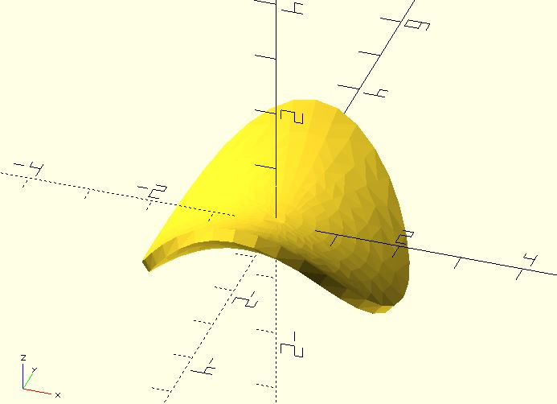
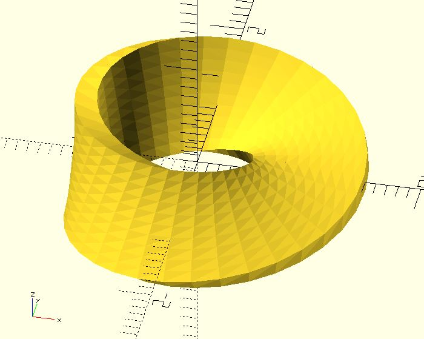

# sf_thickenT

It thickens a surface with triangular mesh. 

## Parameters

- `points` : A list of `[x, y, z]`s.
- `thickness` : The depth of the thickening.
- `triangles` : Determine which points are connected by an edge. All triangles have points in the same direction, counter-clockwise. If it's ignored, `sf_thickenT` would use `[x, y]` to do Delaunay trianglation.  
- `direction` : The direction of thickening. It accepts `"BOTH"` (default), `"FORWARD"` or `"BACKWARD"`. Thickening is applied in both directions from the surface, the direction of the surface normals or the opposite direction to the surface normals. It also accept a direction vector `[x, y, z]`. Thickening is only applied in the direction you give.

## Examples

	use <surface/sf_thickenT.scad>;

	radius = 100;
	thickness = .2;

	a_step = 10;
	r_step = 0.2;

	function f(x, y) = (y^2 - x^2) / 4;

	points = [
		for(a = [a_step:a_step:360], r = [r_step:r_step:2])
		let(
			x = round(r * cos(a) * 100) / 100, 
			y = round(r * sin(a) * 100) / 100
		)
		[x, y, f(x, y)] 
	];

	sf_thickenT(points, thickness);

	use <triangle/tri_delaunay.scad>;
	use <surface/sf_thickenT.scad>;

	u_step = 10;
	v_step = 0.2;
	thickness = .2;

	points = [
		for(u = [0:u_step:360], v = [-1:v_step:1])
		let(
			x = (1 + v / 2 * cos(u / 2)) * cos(u),
			y = (1 + v / 2 * cos(u / 2)) * sin(u),
			z = v / 2 * sin(u / 2)
		)
		[x, y, z]
	];

	triangles = tri_delaunay([
		for(u = [0:u_step:360])
			for(v = [-1:v_step:1])
			[v, u]
	]);

	sf_thickenT(points, thickness, triangles);

