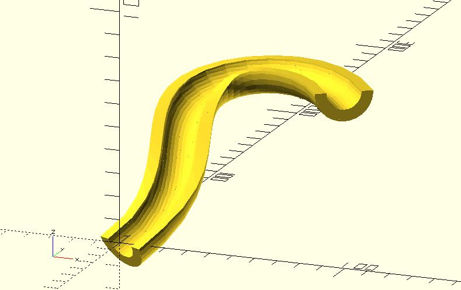

# shape_arc

Returns shape points of an arc shape. They can be used with xxx_extrude modules of dotSCAD. The shape points can be also used with the built-in polygon module. 

## Parameters

- `radius` : The radius of the circle.
- `angle` : A single value or a 2 element vector which defines the central angle. The first element of the vector is the beginning angle in degrees, and the second element is the ending angle.
- `width_mode` : The default value is `"LINE_CROSS"`. The arc line will move outward by `width / 2` and inward by `width / 2`. If it's `"LINE_OUTWARD"`, The arc line moves outward by `width`. The `"LINE_INWARD"` moves the arc line inward by `width`.
- `$fa`, `$fs`, `$fn` : Check [the circle module](https://en.wikibooks.org/wiki/OpenSCAD_User_Manual/Using_the_2D_Subsystem#circle) for more details.

## Examples

    use <shape_arc.scad>

    shape_pts = shape_arc(radius = 10, angle = [-90, 90], width = 5);
    polygon(shape_pts);

    use <shape_arc.scad>
    use <path_extrude.scad>
    use <bezier_curve.scad>

    t_step = 0.05;
    width = 2;

    shape_pts = shape_arc(radius = 10, angle = [180, 360], width = 5);

    p0 = [0, 0, 0];
    p1 = [40, 60, 35];
    p2 = [-50, 70, 45];
    p3 = [20, 150, 55];
    p4 = [80, 50, 60];

    path_pts = bezier_curve(t_step, 
        [p0, p1, p2, p3, p4]
    );

    path_extrude(shape_pts, path_pts);   

