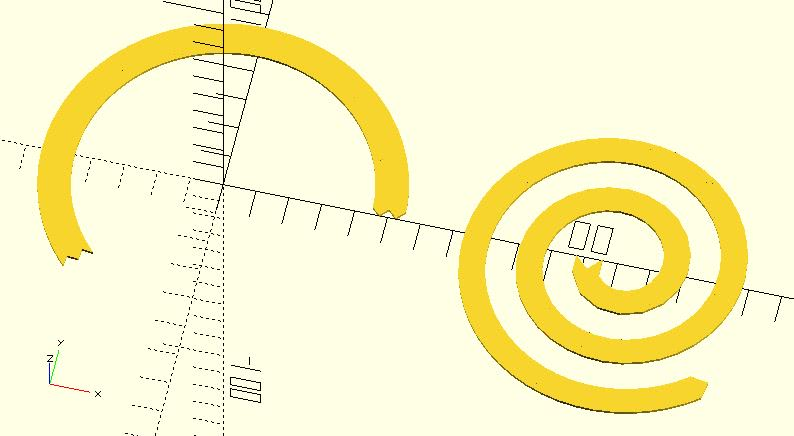
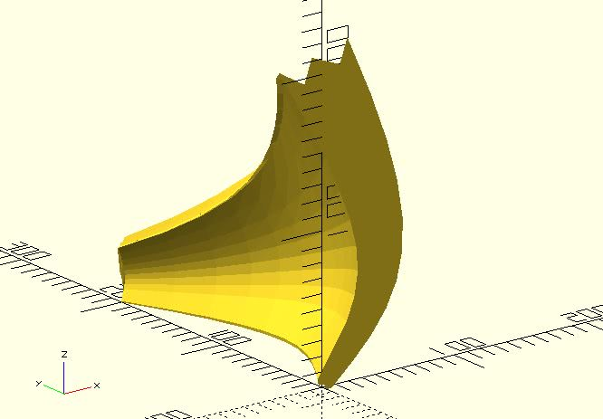

# shape_path_extend

It extends a 2D stroke along a path to create a 2D shape. This module is suitable for a path created by a continuous function. The returned points can be used with xxx_extrude modules of dotSCAD. The shape points can be also used with the built-in polygon module.

When using this function, you should use points to represent the 2D stroke. 

## Parameters

- `stroke_pts` : A list of points represent a stroke. See the example below.
- `path_pts` : A list of points represent the path.
- `scale` : Scales the 2D shape by this value over the length of the extension.
- `closed` : If the first point and the last point of `path_pts` has the same coordinate, setting `closed` to `true` will connect them automatically.

## Examples

	use <shape_path_extend.scad>
	use <shape_circle.scad>
	use <archimedean_spiral.scad>
	
	$fn = 96;
	
	stroke1 = [[-5, 2.5], [-2.5, 0], [0, 2.5], [2.5, 0], [5, 2.5]];
	path_pts1 = shape_circle(50, 60);
    polygon(
	    shape_path_extend(stroke1, path_pts1)
    );
    
	
	stroke2 = [[-4, 0], [0, 4], [4, 0]];
	pts_angles = archimedean_spiral(
	    arm_distance = 17,
	    init_angle = 180,
	    point_distance = 5,
	    num_of_points = 85 
	); 
	
	translate([120, 0, 0]) 
	    polygon(
            shape_path_extend(
	            stroke2, 
	            [for(pa = pts_angles) pa[0]]
	        )
        );

	use <bezier_curve.scad>
	use <shape_path_extend.scad>
	use <path_extrude.scad>
		
	t_step = 0.1;
	width = 2;

	p0 = [0, 0];
	p1 = [40, 60];
	p2 = [50, 90];
	p3 = [0, 200];

	path = bezier_curve(t_step, 
		[p0, p1, p2, p3]
	);

	stroke = [[-5, 2.5], [-2.5, 0], [0, 2.5], [2.5, 0], [5, 2.5]];

	path_extrude(
		shape_path_extend(stroke, path, scale = 5), 
		path,
		scale = 0.1
	);

