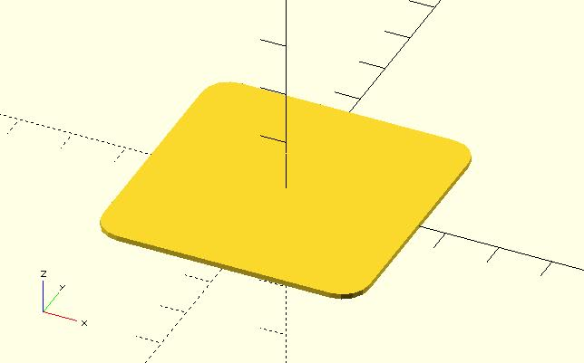

# shape_square

Returns shape points of a rounded square or rectangle. They can be used with xxx_extrude modules of dotSCAD. The shape points can be also used with the built-in polygon module. 

## Parameters

- `size` : Accepts single value, square with both sides this length. It also accepts 2 value array `[x, y]`, rectangle with dimensions `x` and `y`.
- `corner_r` : The corner is one-quarter of a circle (quadrant). The `corner_r` parameter determines the circle radius.
- `$fa`, `$fs`, `$fn` : Used to control the four quadrants. Check [the circle module](https://en.wikibooks.org/wiki/OpenSCAD_User_Manual/Using_the_2D_Subsystem#circle) for more details. The final fragments of a circle will be a multiple of 4 to fit edges.

## Examples

	use <shape_square.scad>

	polygon(
		shape_square(size = 50, corner_r = 5)
	);

	use <shape_square.scad>
	use <ring_extrude.scad>

	$fn = 36;

	shape_pts = shape_square(
		size = [20, 10],
		corner_r = 2
	);

	ring_extrude(
		shape_pts, 
		radius = 50, angle = 180, twist = 180, scale = 2
	);

