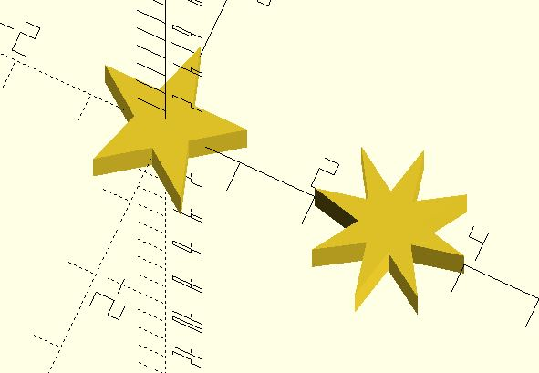

# shape_star 

Create a star. Default to a pentagram.

**Since:** 3.2

## Parameters

- `outer_radius`: the outer radius of the star. Default to 1.
- `inner_radius`: the inner radius of the star. Default to 0.381966.
- `n`: the burst number. Default to 5.

## Examples

	use <shape_star.scad>

	polygon(shape_star());
	translate([3, 0, 0]) 
	    polygon(shape_star(n = 8));

