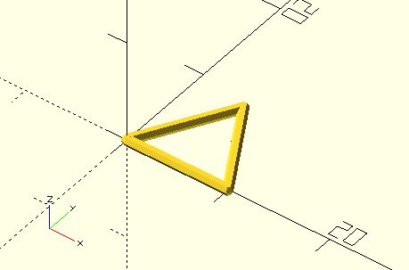

# t3d

An implementation of 3D Turtle Graphics with Fluent API. When using the function, imagine that you are sitting on a turtle. You move or turn the turtle from the your viewpoint, not the viewpoint of OpenSCAD coordinates. 

For more details, please see [3D turtle graphics](https://openhome.cc/eGossip/OpenSCAD/3DTurtleGraphics.html). 

**Since:** 2.1

## Parameters

- `t` : The data of a turtle. `t3d()` with no arguments will return a turtle with the point `[0, 0, 0]` and the unit vectors `[[1, 0, 0], [0, 1, 0], [0, 0, 1]]`.
- `cmd` : It accepts a string or a list of commands. 
    - Given a string: `"xturn"`, `"yturn"`, `"zturn"`, `"xforward"`, `"yforward"`, `"zforward"`, `"point"` or `"unit_vectors"`. If `"xturn"`, `"yturn"` or `"zturn"` is provided, the `angle` parameter is required. If `"xforward"`, `"yforward"` or `"zforward"` is provided, `leng` is required. `"point"` and `"unit_vectors"` are used to get respective data from a turtle.
    - Given a list: `[[cmd1, value], [cmd2, value2], ...]`. For example, `[["xforward", 10], ["zturn", 120]]` will forward a turtle 10mm along the x axis and turn it 120 degrees around the z axis from your viewpoint. 
	- `"roll"`, `"pitch"`, `"turn"` and `"forward"` are supported since 3.3.
- `point` : Set the position of a turtle.
- `unit_vectors` : Set the unit vectors of a turtle.
- `angle` : Set the angle of a turtle if `cmd` is not provided. Turn a turtle if `cmd` is `"xturn"`, `"yturn"` or `"zturn"`. 
- `leng` : Forward a turtle if `cmd` is `"xforward"`, `"yforward"` or `"zforward"`.

## Examples
	    
    use <turtle/t3d.scad>
	use <polyline_join.scad>
	
	leng = 10;
	angle = 120;
	thickness = 1;
	
	t = t3d(point = [0, 0, 0]);
	t2 = t3d(t, "forward", leng = leng);
    t3 = t3d(t2, [
        ["turn", angle],
        ["forward", leng]
    ]);
    t4 = t3d(t3, [
        ["turn", angle],
        ["forward", leng]
    ]);   
    
	polyline_join(
        [for(turtle = [t, t2, t3, t4]) t3d(turtle, "point")]
	) sphere(thickness / 2);

	
	use <line3d.scad>
	use <turtle/t3d.scad>

	module tree(t, leng, leng_scale1, leng_scale2, leng_limit, 
				angleZ, angleX, width) {
		if(leng > leng_limit) {
			t2 = t3d(t, "forward", leng = leng);

			line3d(
				t3d(t, "point"), t3d(t2, "point"), 
				width);

			tree(
				t3d(t2, "turn", angle = angleZ),
				leng * leng_scale1, leng_scale1, leng_scale2, leng_limit, 
				angleZ, angleX, 
				width);

			tree(
				t3d(t2, "roll", angle = angleX), 
				leng * leng_scale2, leng_scale1, leng_scale2, leng_limit, 
				angleZ, angleX, 
				width);
		}    
	}

	leng = 100;
	leng_limit = 1;
	leng_scale1 = 0.4;
	leng_scale2 = 0.9;
	angleZ = 60;
	angleX = 135;
	width = 2;

	t = t3d(point = [0, 0, 0]);

	tree(t, leng, leng_scale1, leng_scale2, leng_limit, 
		angleZ, angleX, width);

