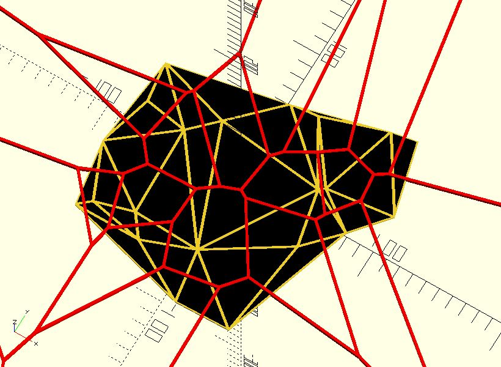

# tri_delaunay

Join a set of points to make a [Delaunay triangulation](https://en.wikipedia.org/wiki/Delaunay_triangulation).

**Since:** 3.0

## Parameters

- `points` : A list of points.
- `ret` : The type of returned data. Default to `"TRI_INDICES"` which returns the indices of the `points`. `"TRI_SHAPES"` returns triangle shapes. `"VORONOI_CELLS"` returns voronoi cells. `"DELAUNAY"` returns a delaunay object which can be processed by [`tri_delaunay_indices`](lib3x-tri_delaunay_indices.html), [`tri_delaunay_shapes`](lib3x-tri_delaunay_shapes.html) and [`tri_delaunay_voronoi`](lib3x-tri_delaunay_voronoi.html).  

## Examples

    use <triangle/tri_delaunay.scad>
    use <polyline_join.scad>

    points = [for(i = [0:20]) rands(-100, 100, 2)]; 

    tris = [for(ti = tri_delaunay(points)) [for(i = ti) points[i]]];
	linear_extrude(1)
	for(t = tris) {
		polygon(t);
	}	
	
	color("black")
	linear_extrude(2)
	for(t = tri_delaunay(points, ret = "TRI_SHAPES")) {
	    offset(-1)
		    polygon(t);
	}	
	
	color("red")
	linear_extrude(3)
	for(t = tri_delaunay(points, ret = "VORONOI_CELLS")) {
	    polyline_join([each t, t[0]])
		    circle(1);
	}

