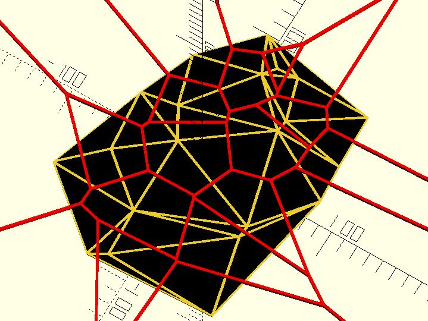

# tri_delaunay_shapes

A method of [`tri_delaunay`](lib3x-tri_delaunay.html). Returns triangle shapes from a delaunay object. 

**Since:** 3.0

## Parameters

- `d` : A delaunay object. 

## Examples

	use <triangle/tri_delaunay.scad>
	use <triangle/tri_delaunay_indices.scad>
	use <triangle/tri_delaunay_shapes.scad>
	use <triangle/tri_delaunay_voronoi.scad>
	use <polyline_join.scad>

	points = [for(i = [0:20]) rands(-100, 100, 2)]; 

	delaunay = tri_delaunay(points, ret = "DELAUNAY");

	tris = [for(ti = tri_delaunay_indices(delaunay)) [for(i = ti) points[i]]];
	linear_extrude(1)
	for(t = tris) {
		polygon(t);
	}	

	color("black")
	linear_extrude(2)
	for(t = tri_delaunay_shapes(delaunay)) {
		offset(-1)
			polygon(t);
	}	

	color("red")
	linear_extrude(3)
	for(t = tri_delaunay_voronoi(delaunay)) {
		polyline_join([each t, t[0]])
		    circle(1);
	}

