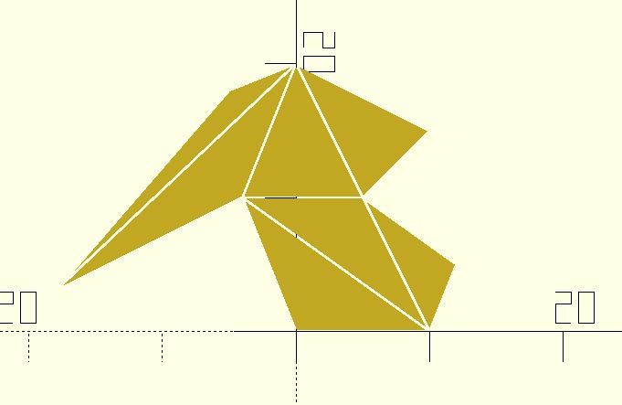

# tri_ear_clipping

Given a 2D shape. This function performs a polygon triangulation based on [Ear clipping](https://en.wikipedia.org/wiki/Polygon_triangulation#Ear_clipping_method).

**Since:** 3.0

## Parameters

- `shape_pts` : The shape points.
- `ret` : The type of returned data. Default to `"TRI_INDICES"` which returns the indices of the `shape_pts`. If `"TRI_SHAPES"` is given, return triangle shapes.
- `epsilon` : An upper bound on the relative error due to rounding in floating point arithmetic. Default to 0.0001.

## Examples

    use <triangle/tri_ear_clipping.scad> 

    shape = [
        [0, 0],
        [10, 0],
        [12, 5],
        [5, 10],
        [10, 15],
        [0, 20],
        [-5, 18],
        [-18, 3],
        [-4, 10]
    ];

    all_indices = tri_ear_clipping(shape);

    for(tri_indices = all_indices) {
        offset(-.1)
            polygon([for(i = tri_indices) shape[i]]);
    }

    use <triangle/tri_ear_clipping.scad> 

    shape = [
        [0, 0],
        [10, 0],
        [12, 5],
        [5, 10],
        [10, 15],
        [0, 20],
        [-5, 18],
        [-18, 3],
        [-4, 10]
    ];

    tris = tri_ear_clipping(shape, ret = "TRI_SHAPES");

    for(tri = tris) {
        offset(-.1)
            polygon(tri);
    }

