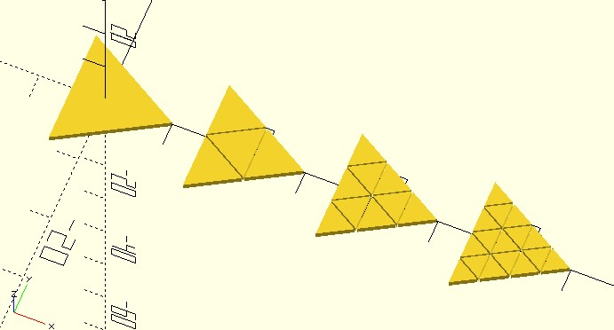

# tri_subdivide

Subdivide a triangle `n` times.

**Since:** 3.3

## Parameters

- `shape_pts` : the vertices of a 2D or 3D triangle.
- `n` : subdivide a triangle `n` times. Default to 1.

## Examples

    use <shape_circle.scad>
    use <triangle/tri_subdivide.scad>
   
    radius = 10;
    tri = shape_circle(radius, $fn = 3);
    
    polygon(tri);
    
    for(n = [1:3]) {
        subdivided = tri_subdivide(tri, n);
        translate([radius * 2 * n, 0])
        for(t = subdivided) {
            offset(-.1)
                polygon(t);
        }
    }

