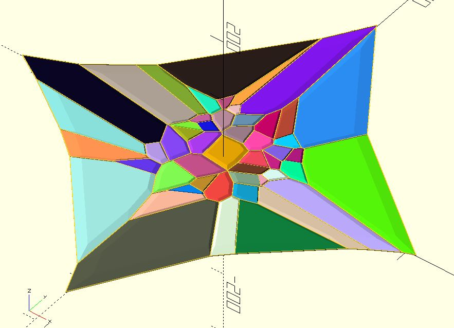

# vrn2_cells_from

Create cell shapes of Voronoi from a list of points. 

**Since:** 2.4

## Parameters

- `points` : Points for each cell. 

## Examples

    use <polyline_join.scad>
    use <voronoi/vrn2_cells_from.scad>

    points = [for(i = [0:50]) rands(-100, 100, 2)]; 

    cells = vrn2_cells_from(points);
    for(i = [0:len(points) - 1]) {
        pt = points[i];
        cell = cells[i];
        
        linear_extrude(1)
        polyline_join([each cell, cell[0]])
		    circle(.5);
        
        color(rands(0, 1, 3))
        translate(pt)    
        linear_extrude(2, scale = 0.8)
        translate(-pt)    
            polygon(cell);
    }

