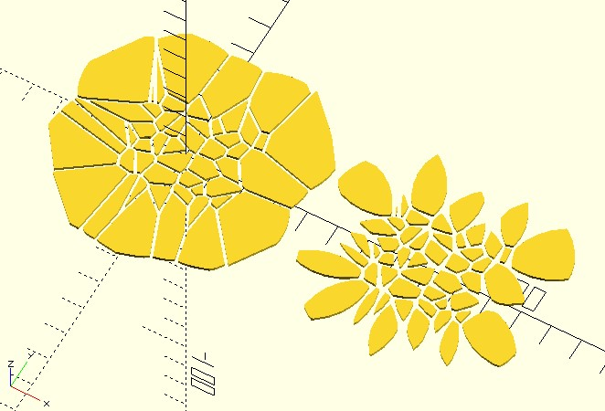

# vrn2_from

Create a [Voronoi diagram](https://en.wikipedia.org/wiki/Voronoi_diagram) from a list of points. 

**Since:** 2.4

## Parameters

- `points` : Points for each cell. 
- `spacing` : Distance between cells. Default to 1.
- `r`, `delta`, `chamfer` : The outlines of each cell can be moved outward or inward. These parameters have the same effect as [`offset`](https://en.wikibooks.org/wiki/OpenSCAD_User_Manual/Transformations#offset). 
- `region_type` : The initial shape for each cell can be `"square"` or `"circle"`. Default to `"square"`.

## Examples

    use <voronoi/vrn2_from.scad>

    points = [for(i = [0:50]) rands(-20, 20, 2)];

    vrn2_from(points);
    translate([80, 0, 0]) 
        vrn2_from(points, region_type = "circle");

    use <voronoi/vrn2_from.scad>
    use <hollow_out.scad>

    xs = rands(0, 40, 50);
    ys = rands(0, 20, 50);

    points = [for(i = [0:len(xs) - 1]) [xs[i], ys[i]]];

    difference() {
        square([40, 20]);
        vrn2_from(points);
    }
    hollow_out(shell_thickness = 1) square([40, 20]);
    
