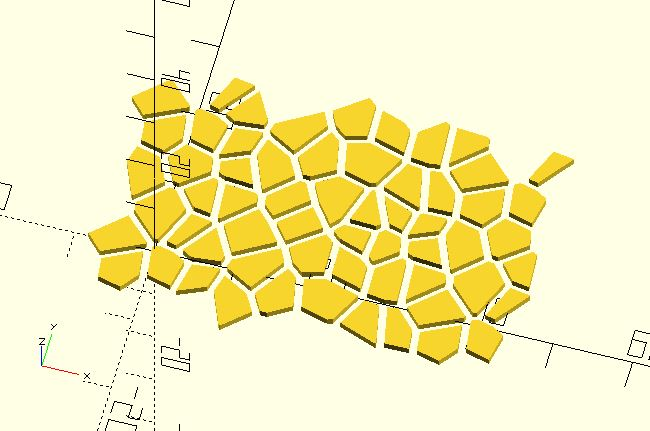

# vrn2_space

Create a [Voronoi diagram](https://en.wikipedia.org/wiki/Voronoi_diagram) in the first quadrant. You specify a space and a grid width. The center of each cell will be distributed in each grid randomly.

**Since:** 2.4

## Parameters

- `size` : 2 value array [x, y], rectangle with dimensions x and y.
- `grid_w` : The width of each grid. If it can split `size` equally, the voronoi diagram is seamless at the junction of top-bottom and left-right. 
- `seed` : Seed value for random number generator for repeatable results.
- `spacing` : Distance between cells. Default to 1.
- `r`, `delta`, `chamfer` : The outlines of each cell can be moved outward or inward. These parameters have the same effect as [`offset`](https://en.wikibooks.org/wiki/OpenSCAD_User_Manual/Transformations#offset). 
- `region_type` : The initial shape for each cell can be `"square"` or `"circle"`. Default to `"square"`.

## Examples

    use <voronoi/vrn2_space.scad>

    vrn2_space(
        size = [40, 20],
        grid_w = 5
    );

    use <bend_extrude.scad>
    use <voronoi/vrn2_space.scad>

    size = [60, 20];

    bend_extrude(size = size, thickness = 1, angle = 360) 
        difference() {
            square(size);
            vrn2_space(
                size = size,
                grid_w = 5,
                seed = 1
            );
        }
    
