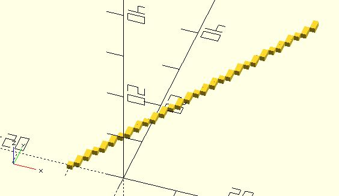
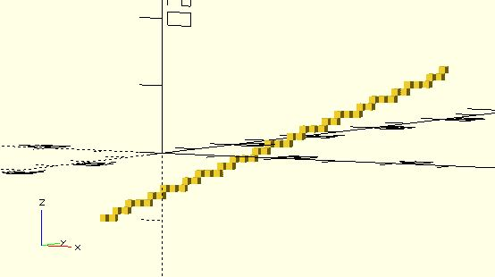

# vx_line

Given two points. `vx_line` returns points that can be used to draw a voxel-style line.

**Since:** 2.4

## Parameters

- `p1` : The start point `[x, y]` or `[x, y, z]`. x, y, z must be integer.
- `p2` : The end point `[x, y]` or `[x, y, z]`. x, y, z must be integer.

## Examples

	use <voxel/vx_line.scad>

	for(pt = vx_line([-10, 0], [20, 50])) {
		translate(pt) 
			square(1, center = true);
	}

	use <voxel/vx_line.scad>

	for(pt = vx_line([-10, 0, -10], [20, 50, 10])) {
		translate(pt) 
			cube(1, center = true);
	}

