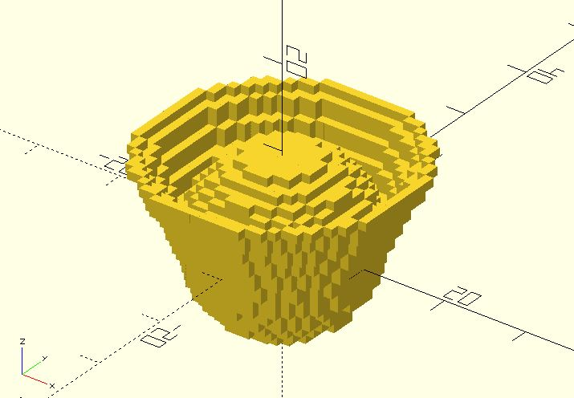

# vx_union

It' slow, in case you want to create a union of two lists of points directly. 

**Since:** 2.4

## Parameters

- `points1` : A list of points.
- `points2` : A list of points.

## Examples

	use <voxel/vx_cylinder.scad>
	use <voxel/vx_sphere.scad>
	use <voxel/vx_union.scad>

	voxels = vx_union(
		vx_cylinder([10, 15], 10),
		vx_sphere(10)
	);

	for(pt = voxels) {
		translate(pt)
			cube(1, center = true);
	}

