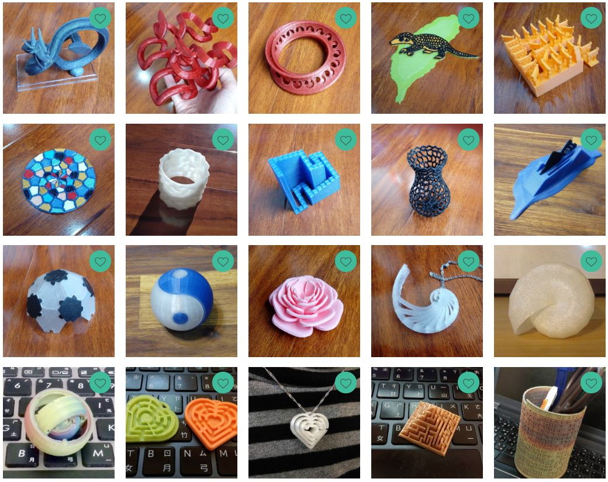
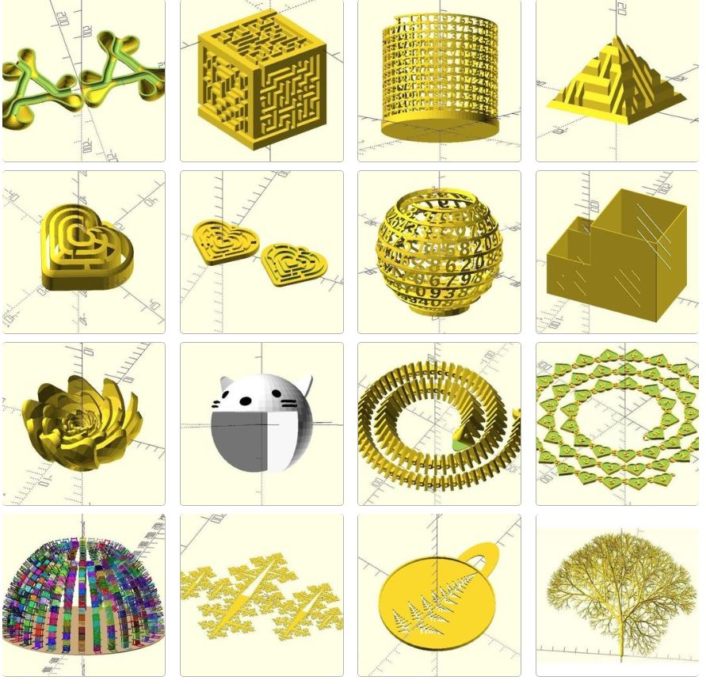

# Dogfooding Examples

These examples incubate dotSCAD and dotSCAD refactors these examples.

- [Printed examples](https://www.myminifactory.com/users/JustinSDK)

- [All examples](https://cults3d.com/en/users/JustinSDK/creations)

